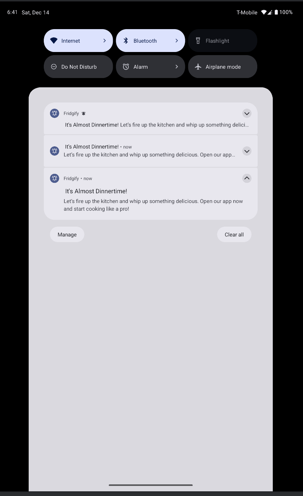

# Chengkai-Jingbo-JK-FinalProject

## Team Name:
JK

## Team member name:
Jingbo Wang, Chengkai Yang

## App Name
Fridgify
- Smart Recipe Recommender

## Brief
A Personalized Recipe Solution to Reduce Food Waste and Simplify Meal Planning

## Project Description

This application provides a range of UI examples and feature demonstrations, including the ability to browse recipes and ingredients, and experience different layouts depending on whether the user is signed in. By leveraging modern Android technologies and libraries, it offers a seamless, responsive, and engaging user experience.

**Key Features**:
- **Android Compatibility:**
  Optimized for Android devices with support starting from `minSdk 24` and targeting `targetSdk 34`, ensuring compatibility across a wide spectrum of phones and tablets.

- **Modern UI with Jetpack Compose:**
  Utilizes Jetpack Compose for building UI elements, offering responsive design that adapts to both portrait and landscape orientations.

- **Dynamic Layouts for Multiple Form Factors:**
  Responsive layouts that scale elegantly between smartphones and tablets, providing an optimized interface for every screen size.

- **Advanced Scanning and Recognition:**
  Integrates with ML Kit’s barcode scanning for easy ingredient identification, enhancing user convenience and interaction.

- **Robust Data Handling:**
  Employs Room for efficient local data storage, and leverages Retrofit and OkHttp for network communication. This ensures smooth, reliable data retrieval and management.

- **Firebase Integration:**
  Incorporates Firebase services for authentication, analytics, cloud data management, and crash reporting, enabling a secure, scalable, and data-driven application.

## APIs Used

In this project, we integrate several external APIs and services to enrich the application’s data and functionalities:

1. **FatSecret API**
   **Usage:**
   - Authentication: Obtaining OAuth tokens to access FatSecret’s platform API.
   - Food Data Retrieval: Searching for food items and retrieving their nutritional information.

   **Benefits:**
   - Access to a comprehensive database of foods and their nutritional details helps us deliver accurate and personalized recipe recommendations.

2. **OpenFoodFacts API**
   **Usage:**
   - Product Details: Fetching product information using scanned barcodes.

   **Benefits:**
   - Enables quick retrieval of product details (product name, ingredients, categories, and image) to enhance the accuracy and speed of adding items to the ingredient list.

3. **Google Custom Search Engine (CSE) API**
   **Usage:**
   - Image Search: Finding a relevant image for an ingredient or food item name.

   **Benefits:**
   - Improves user experience by providing visually recognizable images for the recommended recipes or ingredients.

4. **Firebase Realtime Database**
   **Usage:**
   - Data Storage: Storing, retrieving, and managing user-specific ingredient data and user profiles in real-time.

   **Benefits:**
   - Provides a reliable, cloud-based storage solution for user data. This ensures that user preferences, ingredients, and other details are easily accessible and synchronized across devices.

   Including:
   - Recipes
   - ingredients
   - user information

**Relevant Code Locations:**
```bash
SmartRecipeRecommenderApp/app/src/main/java/com/example/smartreciperecommenderapp/ui/api/FatSecretAuthService.kt
SmartRecipeRecommenderApp/app/src/main/java/com/example/smartreciperecommenderapp/ui/api/GoogleImageSearchService.kt
SmartRecipeRecommenderApp/app/src/main/java/com/example/smartreciperecommenderapp/ui/api/OpenFoodFactsService.kt
SmartRecipeRecommenderApp/app/src/main/java/com/example/smartreciperecommenderapp/ui/api/RetrofitInstance.kt
SmartRecipeRecommenderApp/app/src/main/java/com/example/smartreciperecommenderapp/data/repository/FirebaseIngredientService.kt
SmartRecipeRecommenderApp/app/src/main/java/com/example/smartreciperecommenderapp/data/repository/UserRepository.kt
```

## Sensors Used

In this project, the camera-based barcode scanning functionality is not only dependent on the camera itself but also integrates the phone’s built-in sensors to enhance user experience and scanning accuracy. The main sensors used are:

1. **Gyroscope Sensor (TYPE_GYROSCOPE)**
   **Usage:**
   - The gyroscope sensor is used to detect the device’s rotational and tilt changes. By continuously monitoring the device’s movement, the app can detect when the device remains stable for a certain period (i.e., when it stops shaking) and then automatically trigger the camera’s autofocus.

   **Benefits:**
   - As the user moves their phone to position the barcode within the frame, the image may become blurry. By refocusing once the device stabilizes, the camera can quickly and accurately recognize barcodes, increasing both scanning success rate and user satisfaction.

2. **Light Sensor (TYPE_LIGHT)**
   **Usage:**
   - The light sensor detects ambient light levels. If the user has not manually toggled the flashlight, the app uses data from the light sensor to automatically switch the camera’s flashlight on or off based on the current lighting conditions.

   **Benefits:**
   - In low-light environments, the app automatically turns on the flashlight to provide sufficient illumination for the camera, thereby improving barcode detection accuracy.
   - In well-lit conditions, it keeps the flashlight off to conserve battery life and prevent excessive glare.

**Relevant Code Location:**
```bash
SmartRecipeRecommenderApp/app/src/main/java/com/example/smartreciperecommenderapp/ui/IngredientScreen/camera/CameraPreview.kt
```
Below is an example code snippet demonstrating how the sensors are obtained and used:
```kotlin
// Get SensorManager and sensors
val sensorManager = context.getSystemService(android.content.Context.SENSOR_SERVICE) as SensorManager
val gyroSensor = sensorManager.getDefaultSensor(Sensor.TYPE_GYROSCOPE)
val lightSensor = sensorManager.getDefaultSensor(Sensor.TYPE_LIGHT)

// Gyroscope event listener
val sensorEventListener = object : SensorEventListener {
    var lastFocusTime = System.currentTimeMillis()

    override fun onSensorChanged(event: SensorEvent) {
        val (xRotation, yRotation, zRotation) = event.values
        val rotationMagnitude = sqrt(xRotation * xRotation + yRotation * yRotation + zRotation * zRotation)

        val motionThreshold = 0.5f
        val currentTime = System.currentTimeMillis()
        if (rotationMagnitude > motionThreshold) {
            // Device is moving
            lastFocusTime = currentTime
        } else {
            // Device is stable, refocus after being stable for 2 seconds
            if (currentTime - lastFocusTime > 2000) {
                lastFocusTime = currentTime
                camera?.let { cam ->
                    previewViewRef?.let { pv ->
                        autoFocusCenter(cam, pv)
                    }
                }
            }
        }
    }

    override fun onAccuracyChanged(sensor: Sensor?, accuracy: Int) {
        // Not needed for this use case
    }
}

// Light sensor event listener
val lightEventListener = object : SensorEventListener {
    override fun onSensorChanged(event: SensorEvent) {
        if (!isFlashManuallyControlled && camera?.cameraInfo?.hasFlashUnit() == true) {
            val lux = event.values[0]
            if (lux < 10) {
                camera?.cameraControl?.enableTorch(true)
            } else {
                camera?.cameraControl?.enableTorch(false)
            }
        }
    }

    override fun onAccuracyChanged(sensor: Sensor?, accuracy: Int) {
        // Not needed for this use case
    }
}

// Register listeners
gyroSensor?.let {
    sensorManager.registerListener(sensorEventListener, it, SensorManager.SENSOR_DELAY_GAME)
}

lightSensor?.let {
    sensorManager.registerListener(lightEventListener, it, SensorManager.SENSOR_DELAY_NORMAL)
}
```
## Minimum App Features and Functionality

### Authentication

Our application implements user authentication using **Firebase Authentication**. This enables features such as user sign-in, registration, and email verification, ensuring that only authenticated users can access certain functionalities like managing personal ingredients or viewing personalized recipe recommendations.

**Key Points:**

- **Firebase Authentication:**
  We leverage Firebase Authentication to handle user sign-in and registration, as well as password reset and email verification flows. Users can create accounts using their email addresses and passwords, and then verify their emails to fully activate their accounts.

- **Protected Features:**
  Certain features, such as accessing the user’s personalized ingredient list or adding favorite recipes, require the user to be logged in. If an unauthenticated user attempts to access these areas, the app will redirect them to the Sign-In screen or prompt them to register.

- **State Management and Verification:**
  The `ProfileViewModel` and `UserRepository` classes manage user states, including whether a user is logged in or if their email is verified. The ViewModel observes FirebaseAuth’s user state and updates the UI accordingly, ensuring a seamless user experience.

- **Email Verification and Error Handling:**
  During registration, the user receives a verification email. The app checks `isEmailVerified` before granting full access. If an error occurs (e.g., invalid credentials or unverified email), the app provides user-friendly error messages and instructions on how to proceed.

**Relevant Code Locations:**
```bash
SmartRecipeRecommenderApp/app/src/main/java/com/example/smartreciperecommenderapp/ui/ProfileScreen/ProfileViewModel.kt
SmartRecipeRecommenderApp/app/src/main/java/com/example/smartreciperecommenderapp/data/repository/UserRepository.kt
```

### Real-time Data Sync

Our application employs a synchronization strategy between the local Room database and Firebase (remote data source) to ensure that data remains consistent and up-to-date across different devices in real-time.

**Key Points:**

- **Room and Firebase Integration:**
  We use Room for local data persistence and Firebase (via `FirebaseIngredientService`) for cloud-based data storage. When a user adds or updates ingredients, the changes are saved both locally and in Firebase.

- **Two-way Synchronization:**
  - **From Local to Remote:** When a new ingredient is created or an existing ingredient’s quantity is updated locally, these changes are also pushed to Firebase, ensuring other devices or sessions owned by the same user can see updates in real-time.
  - **From Remote to Local:** On app startup or at scheduled intervals (using WorkManager), we call `syncIngredients()` in the `IngredientRepository`. This compares Firebase’s dataset with the local Room database. If Firebase has more recent or additional items, the local database is updated accordingly, ensuring users always have the latest data even if they were offline before.

- **Deferred Sync:**
  Some operations mark records as “pending sync” locally (e.g., `deleteIngredientLocally()` and `updateIngredientQuantityLocally()`), without immediately communicating changes to Firebase. This allows the app to handle synchronizations efficiently, for example, when the network is available again.

**Relevant Code Locations:**
```bash
SmartRecipeRecommenderApp/app/src/main/java/com/example/smartreciperecommenderapp/data/repository/IngredientRepository.kt
SmartRecipeRecommenderApp/app/src/main/java/com/example/smartreciperecommenderapp/data/repository/FirebaseIngredientService.kt
SmartRecipeRecommenderApp/app/src/main/java/com/example/smartreciperecommenderapp/data/repository/RecipeRepository.kt
SmartRecipeRecommenderApp/app/src/main/java/com/example/smartreciperecommenderapp/data/repository/RecipeDetailRepository.kt
```

### Offline Functionality

Our application is designed to function even with limited or no internet connectivity, thanks to data caching and local persistence managed by the Room database.

**Key Points:**

- **Local Caching with Room:**
  All critical data (ingredients, recipes, and their details) are stored locally using Room. This ensures that users can still view and manage their previously fetched ingredients and recipes, even when offline.

- **Graceful Degradation of Features:**
  When the network is unavailable:
  - The app will not attempt to synchronize data with the remote server and instead rely on the latest cached data.
  - Users can still browse locally stored recipes and ingredients.
  - Any changes made offline (e.g., updating ingredient quantities, deleting items) are recorded locally. The app marks these changes as “pending sync” and will upload them to the server once a network connection is restored.

- **Fallback to Cached Content:**
  In `HomeViewModel` and `IngredientViewModel`, when network calls fail or the network is unavailable, the app fetches data directly from the Room database. This logic ensures that the app remains functional, displaying previously cached content rather than leaving the user with a blank screen.

**Relevant Code Locations:**
```bash
SmartRecipeRecommenderApp/app/src/main/java/com/example/smartreciperecommenderapp/ui/homeScreen/HomeViewModel.kt
SmartRecipeRecommenderApp/app/src/main/java/com/example/smartreciperecommenderapp/ui/IngredientScreen/IngredientViewModel.kt
SmartRecipeRecommenderApp/app/src/main/java/com/example/smartreciperecommenderapp/data/repository/IngredientRepository.kt
```

### Search and Filtering

**Where is the search implemented?**
We provide a search bar in the `IngredientScreen` that allows users to search for ingredients or recipes by name. As the user types, the app calls our backend services to retrieve matching items from the FatSecret API.

**Do we support filtering?**
Currently, the filtering is primarily based on the user's input keyword. The API returns a list of matching results, and we can then further refine or limit these results (e.g., by restricting the maximum number of results or by selecting certain categories) before displaying them.

**How does it work?**
1. **User Input:**
   In `IngredientScreen`, when the user enters a search term, a network request is triggered to the FatSecret API via `searchFoods()` or `searchRecipes()` methods.

2. **Data Retrieval:**
   The Retrofit-based API calls return a list of items (foods or recipes) that match the search term.

3. **Displaying Results:**
   The UI updates to display the returned items. If needed, additional filtering (e.g., by nutritional criteria or categories) can be applied to the search results before they are shown to the user.

This approach ensures users can quickly find relevant ingredients or recipes by simply typing in what they’re looking for, while still having the flexibility to refine the returned results.

### User Interaction and App Feedback

Our application provides various interactive elements and immediate feedback mechanisms to enhance the user experience:

**Key Points:**

- **Interactive Search and Results Display:**
  Users can type into a search bar to find ingredients or recipes. As they type, the app displays relevant search results in real-time. Clearing the search input immediately updates the results to show an empty state, providing instant feedback.

- **Editable and Deletable Items:**
  On the Ingredients screen, users can:
  - **Edit Quantity:** By tapping an edit icon, a dialog appears, allowing users to update the quantity of an ingredient. Once the user confirms, the updated quantity reflects in the UI immediately.
  - **Delete Ingredients:** Users can remove ingredients from their list by tapping a delete icon. The ingredient card first fades out (using `AnimatedVisibility`), providing visual feedback that the item is being removed, before it is actually deleted from the database.

- **Smooth Animations for Enhanced Feedback:**
  Through Jetpack Compose’s animation APIs, the deletion process and other state changes are presented smoothly. Users see a fade-out animation when an item is removed, making the interface feel more responsive and polished.

**Relevant Code Locations:**
```bash
SmartRecipeRecommenderApp/app/src/main/java/com/example/smartreciperecommenderapp/ui/IngredientScreen/IngredientScreen.kt
SmartRecipeRecommenderApp/app/src/main/java/com/example/smartreciperecommenderapp/ui/homeScreen/units/RecipeDetailsPane.kt
```

## UI and UX Design

### Navigation

We implemented a multi-screen flow using the Jetpack Navigation component and a bottom navigation bar to enable smooth navigation between different parts of the app. Each screen in our application is represented as a composable and associated with a route defined in the navigation graph (`NavGraph.kt`). Users can easily switch between the Home, Account, and Ingredient screens using the bottom navigation bar.

**Key Points:**

- **Jetpack Navigation Component:**
  We use `NavHost` and `NavController` to define and manage navigation between composable destinations. This ensures a clear separation of navigation logic and UI code, making the code more maintainable and easier to extend.

- **Bottom Navigation Bar:**
  The bottom navigation bar provides quick access to the main sections of the app, including Home, Account, and Ingredients. Icons and labels guide users, while tapping on an icon switches to the corresponding screen.

- **Multi-Screen Flow:**
  Our navigation graph (`NavGraph.kt`) defines multiple routes:
  - `Home` screen: Displays recommended recipes and allows users to explore new dishes.
  - `Account` screen: Manages user authentication, sign-in, and displays user profile info, saved recipes, and preferences.
  - `Ingredient` screen: Enables users to manage their ingredients, add new items from barcode scanning, and view product details.

- **Conditional Navigation Based on User State:**
  The app dynamically navigates users to sign-in or registration screens if they try to access restricted features without being logged in. After successful sign-in or account registration, the user is redirected back to the appropriate screen.

**Relevant Code Location:**
```bash
SmartRecipeRecommenderApp/app/src/main/java/com/example/smartreciperecommenderapp/ui/navigation/NavGraph.kt
SmartRecipeRecommenderApp/app/src/main/java/com/example/smartreciperecommenderapp/ui/BottomNavigationBar.kt
```

### Animations

Our project integrates animations to provide a smoother and more engaging user experience. By leveraging Jetpack Compose’s built-in animation APIs, we enhance the usability and aesthetic appeal of various UI elements.

**Key Points:**

- **AnimatedVisibility for Smooth Transitions:**
  We utilize `AnimatedVisibility` to animate the appearance and disappearance of UI components. For example, when users edit or remove an ingredient, the ingredient card smoothly fades in or out instead of appearing or disappearing abruptly. This creates a more natural, fluid user interaction.

- **Use Cases in the Ingredient Screen:**
  In `IngredientScreen.kt`, when an ingredient is deleted, `AnimatedVisibility` is used to fade out the card before it’s removed from the list. Similarly, expanding or collapsing sections (such as expired ingredients) uses animation to give users a more intuitive sense of openness and closure.

**Relevant Code Snippet:**
```kotlin
@Composable
fun IngredientItemCard(
    ingredient: Ingredient,
    onDeleteClick: () -> Unit,
    onEditClick: (Ingredient) -> Unit
) {
    var visible by remember { mutableStateOf(true) }

    // Animate visibility changes for a smooth deletion effect
    AnimatedVisibility(
        visible = visible,
        enter = fadeIn(),
        exit = fadeOut()
    ) {
        // ... card content ...
    }
}
```

## Core Jetpack Libraries

### ViewModel

Our project includes several ViewModel classes (`HomeViewModel`, `ProfileViewModel`, `IngredientViewModel`) to manage UI-related data and handle logic in a lifecycle-aware manner. By separating data handling from the UI layer, ViewModels help maintain a clean architecture, improve testability, and ensure data persists across configuration changes (e.g., screen rotations).

### LiveData or StateFlow

``` kotlin
private val _recipes = MutableStateFlow<List<RecipeModel>>(emptyList())
val recipes = _recipes.asStateFlow()

private val _isLoading = MutableStateFlow(false)
val isLoading = _isLoading.asStateFlow()

// Now using RecipeDetailModel for selected details
private val _selectedRecipeDetails = MutableStateFlow<RecipeDetailModel?>(null)
val selectedRecipeDetails = _selectedRecipeDetails.asStateFlow()

private val _errorMessage = MutableStateFlow<String?>(null)
val errorMessage = _errorMessage.asStateFlow()
```
### WorkManager
- **Periodic Data Sync**:
  For instance, we set up a WorkManager `PeriodicWorkRequest` to periodically sync the local database (Room) with the remote Firebase data source. This ensures that the app’s content stays up-to-date with minimal user intervention, and improves the overall reliability of our syncing strategy.

**Relevant Code Location:**

```bash
SmartRecipeRecommenderApp/app/src/main/java/com/example/smartreciperecommenderapp/data/workers/DataSyncWorker.kt
```

**Example Implementation:**

```
class DataSyncWorker(
    context: Context,
    params: WorkerParameters,
    private val ingredientRepository: IngredientRepository
) : CoroutineWorker(context, params) {

    override suspend fun doWork(): Result {
        return withContext(Dispatchers.IO) {
            try {
                ingredientRepository.syncIngredients()
                Result.success()
            } catch (e: Exception) {
                Result.retry()
            }
        }
    }
}

// Schedule background tasks
val workRequest = PeriodicWorkRequestBuilder<DataSyncWorker>(1, TimeUnit.HOURS).build()
WorkManager.getInstance(this).enqueueUniquePeriodicWork(
    "DataSyncWork",
    ExistingPeriodicWorkPolicy.KEEP,
    workRequest
)
```

## Data Persistence and Caching

### Data Persistence with Room

**IngredientEntity** (stored locally for quick access)

**Fields:**
| Field      | Type    | Description                          |
|------------|---------|--------------------------------------|
| instanceId | Int     | Auto-generated primary key, unique identifier for each ingredient instance |
| id         | Int     | Unique identifier for the ingredient |
| name       | String  | The name of the ingredient           |
| quantity   | Double  | The quantity of the ingredient       |
| unit       | String  | The unit of measurement for the quantity (e.g., grams, ml, pieces) |
| category   | String  | The category this ingredient belongs to (e.g., Dairy, Vegetables) |
| expiryDate | Long?   | The expiration date in milliseconds since epoch, optional |
| imageUrl   | String? | URL of an image representing the ingredient, optional |
| calories   | Double? | Caloric content of the ingredient, optional |
| fat        | Double? | Fat content of the ingredient, optional |

**IngredientDao** provides CRUD operations for local data management, including:
- Retrieving all ingredients
- Inserting or updating ingredients
- Deleting ingredients by instanceId
- Updating ingredient quantities

**RecipeModel** (used as a data/model layer representation)

**Fields:**
| Field           | Type            | Description                                                                 |
|-----------------|-----------------|-----------------------------------------------------------------------------|
| id              | Long            | Unique identifier for the recipe                                            |
| name            | String          | Recipe name                                                                 |
| description     | String          | A brief description of the recipe                                           |
| imageUrl        | String?         | Optional URL to an image of the recipe                                      |
| calories        | String          | Calorie content of the recipe, represented as a string                      |
| carbohydrate    | String          | Carbohydrate content of the recipe, represented as a string                 |
| fat             | String          | Fat content of the recipe, represented as a string                          |
| protein         | String          | Protein content of the recipe, represented as a string                      |
| ingredients     | List<String>    | A list of ingredients used in the recipe                                    |
| types           | List<String>?   | Optional list of recipe categories or types                                 |
| originIngredient| String?         | An optional field indicating the primary or original ingredient of the dish |

**RecipeDetailDao** provides operations to manage detailed recipe information within the local database:
- Inserts or replaces a `RecipeDetailEntity` in the local database. This ensures that the detailed recipe information is stored and updated as needed.
- Retrieves the detailed recipe entity corresponding to the given `recipeId`. Returns `null` if no matching record is found.

**Relationship Diagram**

- **Users → 1-to-many → Ingredients**
- **Users → 1-to-many → Recipes**
- **Recipes → many-to-many → Ingredients** (through a Recipe-Ingredients join table)
- **Users → 1-to-many → Offline Cache**

### Data Caching
In our project, we will fetch the data (such as ingredients and recipe details) from the API only during the initial request, then store it in a local Room database. The application will load the information directly from the cached database for subsequent requests instead of making additional network calls. This approach significantly reduces network usage and improves our application's overall efficiency and responsiveness.
For example:
``` kotlin
// Use existing recipes from the database for unchanged ingredients
currentIngredientNames.subtract(addedIngredients).forEach { ingredientName ->
    val localRecipes = recipeRepository.getRecipesByIngredient(ingredientName)
    val selectedRecipes = localRecipes.shuffled().take(2)
    allSelectedModels.addAll(selectedRecipes)
}

// Fallback image fetch if needed
val updatedModels = allSelectedModels.map { model ->
    if (model.imageUrl == null) {
        val googleImage = googleImageSearchService.fetchFirstImageForFood(model.name)
        if (googleImage != null) {
            recipeRepository.updateRecipeImageUrl(model.id, googleImage)
            model.copy(imageUrl = googleImage)
        } else {
            model
        }
    } else {
        model
    }
}
```

### Data Syncing Mechanism

Our project implements a basic syncing strategy between the local database (Room) and a remote data source (Firebase). This approach ensures that users can work with local data when offline and have their changes synced to the server once connectivity is restored.

**Key Points:**

#### Initial Fetch & Storage
When an ingredient is first created, it is saved both locally (using Room) and remotely (using Firebase). The repository (`IngredientRepository`) assigns a unique `instanceId` to each ingredient and ensures that this data is consistent across local and remote stores.

#### Syncing From Remote to Local
The `syncIngredients()` function retrieves all ingredients from Firebase and compares them to the local data. If Firebase has more data than the local database, the local database is updated to match Firebase. This simple downlink synchronization ensures the local cache remains up-to-date when new items appear on the server.

#### Two-Way Updates
For changes to an ingredient's quantity or deletion, we have two modes:

- **Immediate Sync:**
  Some updates, such as `updateIngredientQuantity()` or `deleteIngredient()`, modify both the local Room database and the remote Firebase data source right away, keeping both stores consistent.

- **Deferred Sync:**
  Other operations, such as `deleteIngredientLocally()` and `updateIngredientQuantityLocally()`, only mark the changes locally as "pending sync." These changes are not immediately sent to Firebase, allowing the application to handle synchronization at a later time (e.g., when network connectivity is stable).

## Testing and Quality Assurance

### Unit Tests

We have incorporated unit tests for several components of our application, including the `IngredientRepository`, `RecipeRepository`, and `RecipeDetailRepository`. These tests are designed to validate our data logic and ensure that our code functions correctly in isolation, without requiring a running application or backend services.

**Key Points:**

- **Frameworks & Tools:**
  We utilize **JUnit** as the fundamental testing framework, combined with **Mockito** for mocking dependencies and **Truth** for clear and expressive assertions. This setup allows us to precisely control test conditions and verify the behavior of our repositories.

- **Test Coverage:**
  The unit tests focus on:
  - Verifying the correct mapping from database entities to domain models.
  - Ensuring that repository methods behave as expected when given empty or populated lists.
  - Confirming that any logic (like assigning instance IDs, caching data, or handling null values) operates correctly under various conditions.

- **Benefits:**
  By writing these unit tests, we catch potential logic errors early in the development process. This reduces the likelihood of bugs reaching production, contributes to more maintainable and reliable code, and improves our confidence when making changes or adding new features.

**How to Run the Tests:**
You can execute the unit tests using the following command:
```bash
./gradlew test
```


### Error Logging

Our project includes a robust error logging mechanism to ensure that crashes and exceptions can be monitored and addressed promptly. We have integrated **Firebase Crashlytics**, a real-time error logging and crash reporting service from Firebase, to capture and report any runtime issues directly from the user's device.

**Key Points:**

- **Real-time Monitoring:**
  When an exception occurs in the application, we log the error locally using the standard `Log.e` method and then record the same exception in Firebase Crashlytics. This ensures that we have both local and remote records of the error.

- **Seamless Integration with Firebase:**
  By leveraging the Firebase Crashlytics SDK, all exceptions are automatically collected and made available on the Firebase console. This helps the development team quickly identify the root cause, pinpoint problematic code, and take swift action to resolve the issues.

- **Improved User Experience:**
  Users benefit from a more stable and reliable application. As we monitor and resolve errors in near real-time, updates and fixes can be rolled out more efficiently, reducing the frequency and severity of future issues.

**Code Example:**
```kotlin
catch (e: Exception) {
    // local Log
    Log.e("HomeViewModel", "Error loading recipe details", e)

    // Use Crashlytics to upload exception
    FirebaseCrashlytics.getInstance().recordException(e)

    val errorMessage = when (e) {
        is java.net.UnknownHostException -> "Network error: Unable to load recipes. Please check your internet connection."
        is java.net.SocketTimeoutException -> "Network error: Request timed out. Please try again."
        else -> "Failed to load recipes. Please try again later."
    }
    _errorMessage.value = errorMessage
}
```

## Additional Features
- Firebase Cloud Massaging Notification: Use Firebase Cloud Messaging to implement push notifications to inform users about important updates or events.
``` kotlin
class FirebaseMessagingService : FirebaseMessagingService() {

    override fun onMessageReceived(remoteMessage: RemoteMessage) {
        super.onMessageReceived(remoteMessage)
        // Processing messages from the server
        remoteMessage.notification?.let {
            val title = it.title
            val body = it.body
            showNotification(title, body)
        }
        remoteMessage.data.isNotEmpty().let {
            Log.d("FCM", "Message data payload: ${remoteMessage.data}")
        }
    }

    private fun showNotification(title: String?, message: String?) {
        // Create notification channels (for Android 8.0+)
        val channelId = "default_channel_id"
        val channelName = "Default Channel"
        val notificationManager = getSystemService(Context.NOTIFICATION_SERVICE) as NotificationManager

        if (Build.VERSION.SDK_INT >= Build.VERSION_CODES.O) {
            val channel = NotificationChannel(
                channelId,
                channelName,
                NotificationManager.IMPORTANCE_DEFAULT
            )
            notificationManager.createNotificationChannel(channel)
        }

        val notificationBuilder = NotificationCompat.Builder(this, channelId)
            .setSmallIcon(R.drawable.ic_notification)
            .setContentTitle(title)
            .setContentText(message)
            .setAutoCancel(true)
            .setPriority(NotificationCompat.PRIORITY_DEFAULT)

        notificationManager.notify(System.currentTimeMillis().toInt(), notificationBuilder.build())
        Log.d("FCM", "Notification received: $title, $message")
    }

    override fun onNewToken(token: String) {
        super.onNewToken(token)
        // Send the updated token to the server
        Log.d("FCM", "Refreshed token: $token")
    }
}
```

## App Screens

Below are some example UI screens and functionalities captured from the current directory:

### Home Screen (Without Sign-in)


### Ingredient Screen (Without Sign-in)


### Account Screen (Without Sign-in)


### Home Screen (With Sign-in)


### Ingredient Screen (With Sign-in)


### Account Screen (With Sign-in)


### Recipe Detail Screen (With Sign-in)


### Ingredient Detail


### Barcode Scanning Function


### Firebase Cloud Massaging Notification

