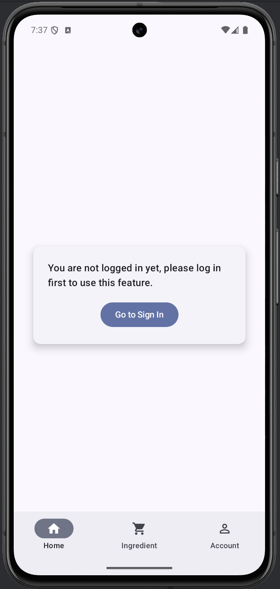
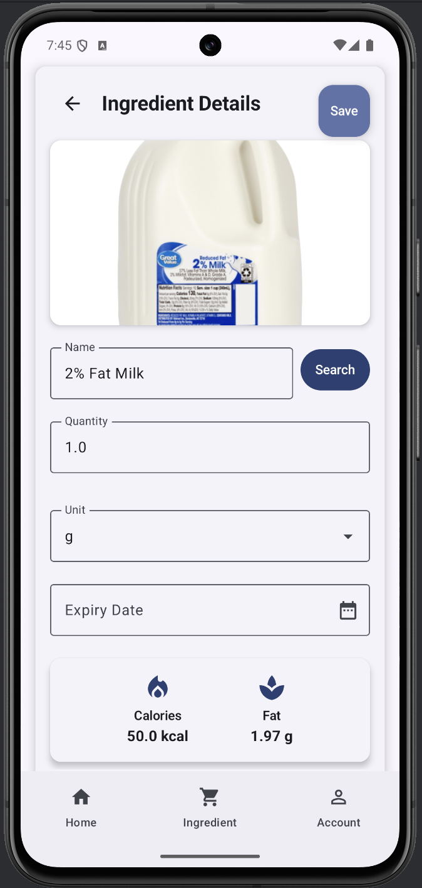
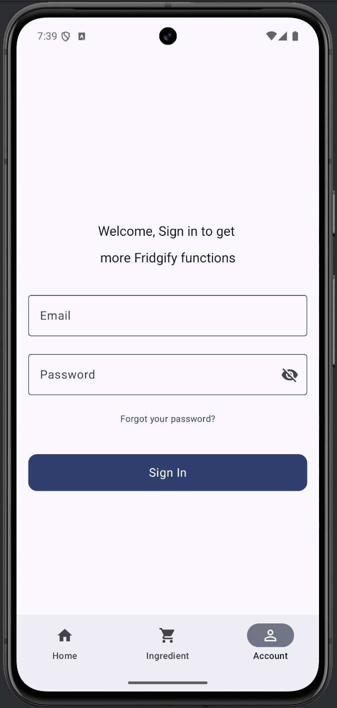
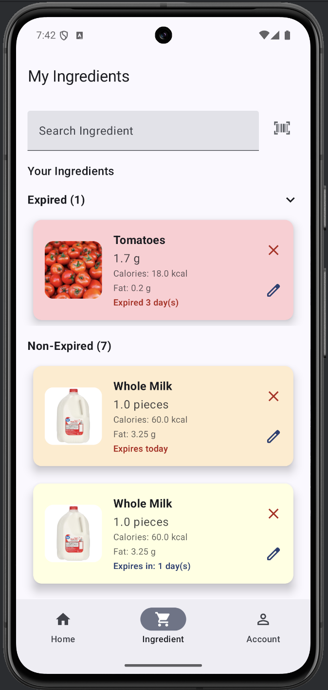
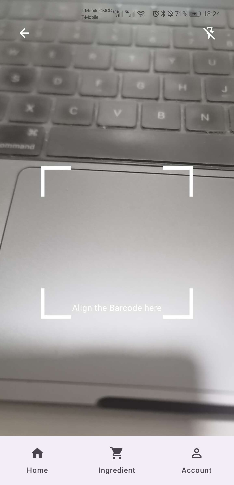
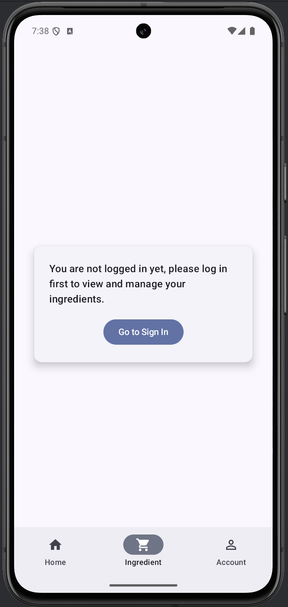

# Chengkai-Jingbo-JK-FinalProject

## Team Name:
JK

## Team member name:
Jingbo Wang, Chengkai Yang

## App Name
Fridgify
- Smart Recipe Recommender

## Brief
A Personalized Recipe Solution to Reduce Food Waste and Simplify Meal Planning

## APIs Used

In this project, we integrate several external APIs and services to enrich the application’s data and functionalities:

1. **FatSecret API**
   **Usage:**
   - Authentication: Obtaining OAuth tokens to access FatSecret’s platform API.
   - Food Data Retrieval: Searching for food items and retrieving their nutritional information.

   **Benefits:**
   - Access to a comprehensive database of foods and their nutritional details helps us deliver accurate and personalized recipe recommendations.

2. **OpenFoodFacts API**
   **Usage:**
   - Product Details: Fetching product information using scanned barcodes.

   **Benefits:**
   - Enables quick retrieval of product details (product name, ingredients, categories, and image) to enhance the accuracy and speed of adding items to the ingredient list.

3. **Google Custom Search Engine (CSE) API**
   **Usage:**
   - Image Search: Finding a relevant image for an ingredient or food item name.

   **Benefits:**
   - Improves user experience by providing visually recognizable images for the recommended recipes or ingredients.

4. **Firebase Realtime Database**
   **Usage:**
   - Data Storage: Storing, retrieving, and managing user-specific ingredient data and user profiles in real-time.

   **Benefits:**
   - Provides a reliable, cloud-based storage solution for user data. This ensures that user preferences, ingredients, and other details are easily accessible and synchronized across devices.
      
   Including:
   - Recipes
   - ingredients
   - user information

**Relevant Code Locations:**
```bash
SmartRecipeRecommenderApp/app/src/main/java/com/example/smartreciperecommenderapp/ui/api/FatSecretAuthService.kt
SmartRecipeRecommenderApp/app/src/main/java/com/example/smartreciperecommenderapp/ui/api/GoogleImageSearchService.kt
SmartRecipeRecommenderApp/app/src/main/java/com/example/smartreciperecommenderapp/ui/api/OpenFoodFactsService.kt
SmartRecipeRecommenderApp/app/src/main/java/com/example/smartreciperecommenderapp/ui/api/RetrofitInstance.kt
SmartRecipeRecommenderApp/app/src/main/java/com/example/smartreciperecommenderapp/data/repository/FirebaseIngredientService.kt
SmartRecipeRecommenderApp/app/src/main/java/com/example/smartreciperecommenderapp/data/repository/UserRepository.kt
```

## Sensors Used

In this project, the camera-based barcode scanning functionality is not only dependent on the camera itself but also integrates the phone’s built-in sensors to enhance user experience and scanning accuracy. The main sensors used are:

1. **Gyroscope Sensor (TYPE_GYROSCOPE)**
   **Usage:**
   - The gyroscope sensor is used to detect the device’s rotational and tilt changes. By continuously monitoring the device’s movement, the app can detect when the device remains stable for a certain period (i.e., when it stops shaking) and then automatically trigger the camera’s autofocus.

   **Benefits:**
   - As the user moves their phone to position the barcode within the frame, the image may become blurry. By refocusing once the device stabilizes, the camera can quickly and accurately recognize barcodes, increasing both scanning success rate and user satisfaction.

2. **Light Sensor (TYPE_LIGHT)**
   **Usage:**
   - The light sensor detects ambient light levels. If the user has not manually toggled the flashlight, the app uses data from the light sensor to automatically switch the camera’s flashlight on or off based on the current lighting conditions.

   **Benefits:**
   - In low-light environments, the app automatically turns on the flashlight to provide sufficient illumination for the camera, thereby improving barcode detection accuracy.
   - In well-lit conditions, it keeps the flashlight off to conserve battery life and prevent excessive glare.

**Relevant Code Location:**
```bash
SmartRecipeRecommenderApp/app/src/main/java/com/example/smartreciperecommenderapp/ui/IngredientScreen/camera/CameraPreview.kt
```
Below is an example code snippet demonstrating how the sensors are obtained and used:
```kotlin
// Get SensorManager and sensors
val sensorManager = context.getSystemService(android.content.Context.SENSOR_SERVICE) as SensorManager
val gyroSensor = sensorManager.getDefaultSensor(Sensor.TYPE_GYROSCOPE)
val lightSensor = sensorManager.getDefaultSensor(Sensor.TYPE_LIGHT)

// Gyroscope event listener
val sensorEventListener = object : SensorEventListener {
    var lastFocusTime = System.currentTimeMillis()

    override fun onSensorChanged(event: SensorEvent) {
        val (xRotation, yRotation, zRotation) = event.values
        val rotationMagnitude = sqrt(xRotation * xRotation + yRotation * yRotation + zRotation * zRotation)

        val motionThreshold = 0.5f
        val currentTime = System.currentTimeMillis()
        if (rotationMagnitude > motionThreshold) {
            // Device is moving
            lastFocusTime = currentTime
        } else {
            // Device is stable, refocus after being stable for 2 seconds
            if (currentTime - lastFocusTime > 2000) {
                lastFocusTime = currentTime
                camera?.let { cam ->
                    previewViewRef?.let { pv ->
                        autoFocusCenter(cam, pv)
                    }
                }
            }
        }
    }

    override fun onAccuracyChanged(sensor: Sensor?, accuracy: Int) {
        // Not needed for this use case
    }
}

// Light sensor event listener
val lightEventListener = object : SensorEventListener {
    override fun onSensorChanged(event: SensorEvent) {
        if (!isFlashManuallyControlled && camera?.cameraInfo?.hasFlashUnit() == true) {
            val lux = event.values[0]
            if (lux < 10) {
                camera?.cameraControl?.enableTorch(true)
            } else {
                camera?.cameraControl?.enableTorch(false)
            }
        }
    }

    override fun onAccuracyChanged(sensor: Sensor?, accuracy: Int) {
        // Not needed for this use case
    }
}

// Register listeners
gyroSensor?.let {
    sensorManager.registerListener(sensorEventListener, it, SensorManager.SENSOR_DELAY_GAME)
}

lightSensor?.let {
    sensorManager.registerListener(lightEventListener, it, SensorManager.SENSOR_DELAY_NORMAL)
}
```

## Room Database Entities & DAOs

**IngredientEntity** (stored locally for quick access)

**Fields:**
| Field      | Type    | Description                          |
|------------|---------|--------------------------------------|
| instanceId | Int     | Auto-generated primary key, unique identifier for each ingredient instance |
| id         | Int     | Unique identifier for the ingredient |
| name       | String  | The name of the ingredient           |
| quantity   | Double  | The quantity of the ingredient       |
| unit       | String  | The unit of measurement for the quantity (e.g., grams, ml, pieces) |
| category   | String  | The category this ingredient belongs to (e.g., Dairy, Vegetables) |
| expiryDate | Long?   | The expiration date in milliseconds since epoch, optional |
| imageUrl   | String? | URL of an image representing the ingredient, optional |
| calories   | Double? | Caloric content of the ingredient, optional |
| fat        | Double? | Fat content of the ingredient, optional |

**IngredientDao** provides CRUD operations for local data management, including:
- Retrieving all ingredients
- Inserting or updating ingredients
- Deleting ingredients by instanceId
- Updating ingredient quantities

```kotlin
@Dao
interface IngredientDao {
    @Query("SELECT * FROM ingredient")
    suspend fun getAllIngredients(): List<IngredientEntity>

    @Insert(onConflict = OnConflictStrategy.REPLACE)
    suspend fun insertIngredient(ingredient: IngredientEntity)

    @Insert(onConflict = OnConflictStrategy.REPLACE)
    suspend fun insertIngredients(ingredients: List<IngredientEntity>)

    @Update
    suspend fun updateIngredient(ingredient: IngredientEntity)

    @Query("DELETE FROM ingredient WHERE instanceId = :instanceId")
    suspend fun deleteIngredientByInstanceId(instanceId: Int)

    @Query("DELETE FROM ingredient")
    suspend fun deleteAll()

    @Query("SELECT MAX(instanceId) FROM ingredient")
    suspend fun getMaxInstanceId(): Int?

    @Query("UPDATE ingredient SET quantity = :quantity WHERE instanceId = :instanceId")
    suspend fun updateIngredientQuantity(instanceId: Int, quantity: Double)
}
```

**Relationship Diagram**

- **Users → 1-to-many → Ingredients**
- **Users → 1-to-many → Recipes**
- **Recipes → many-to-many → Ingredients** (through a Recipe-Ingredients join table)
- **Users → 1-to-many → Offline Cache**
- **Users → 1-to-many → Analytics**

## App Screens

Below are some example UI screens and functionalities captured from the current directory:

- **Account Screen (with Sign-in)**
  

- **Home Screen (without Sign-in)**
  

- **Ingredient Detail**
  

- **Account Screen (without Sign-in)**
  

- **Ingredient Screen (with Sign-in)**
  

- **Barcode Scanning Function**
  

- **Ingredient Screen (without Sign-in)**
  
