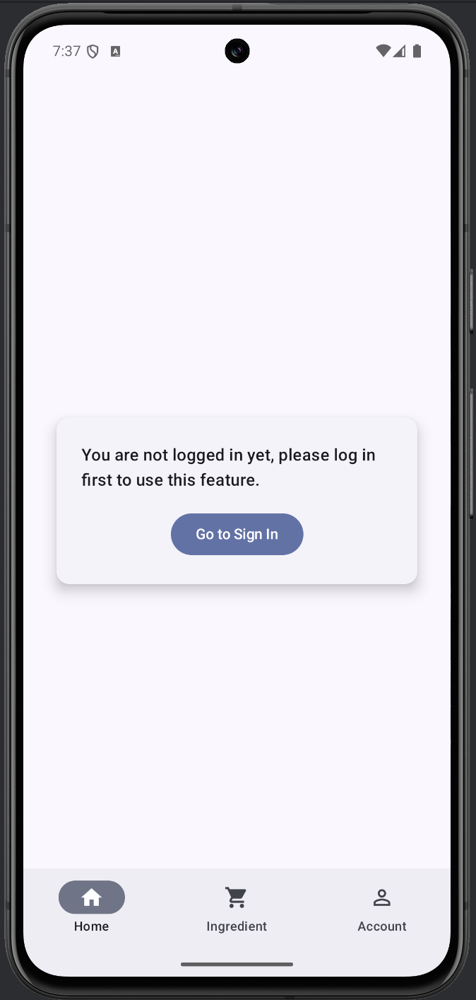
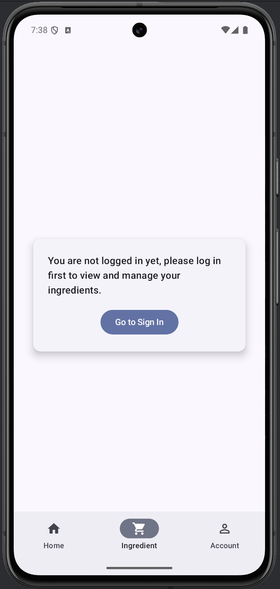
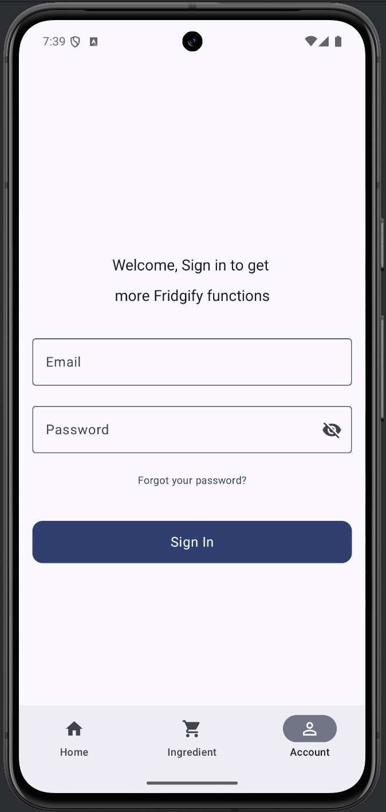
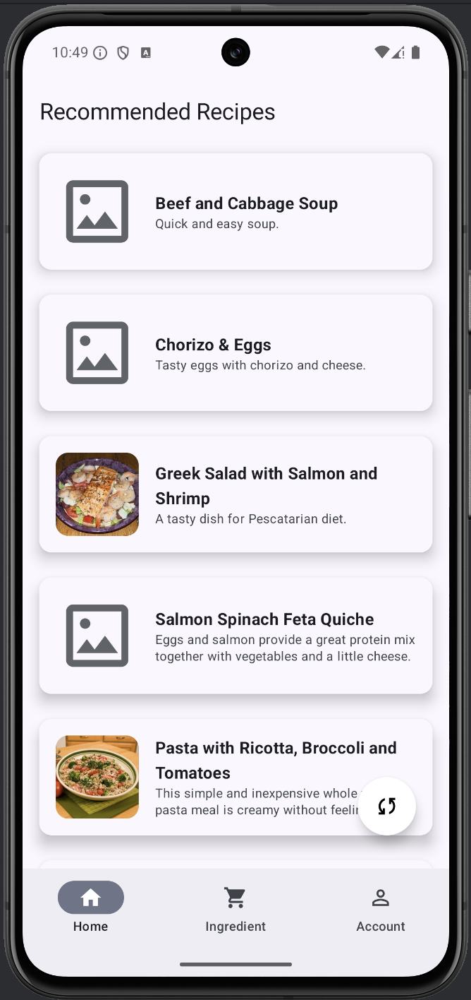
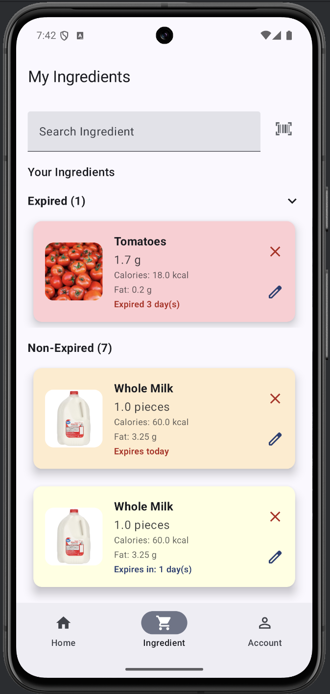
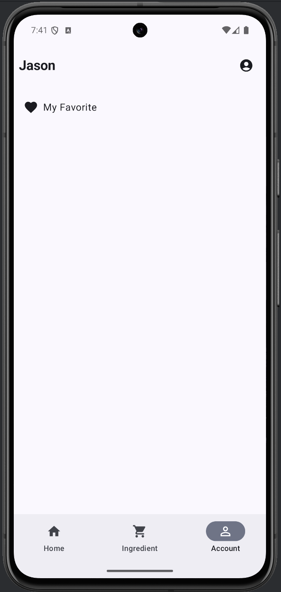

# Chengkai-Jingbo-JK-FinalProject

## Team Name:
JK

## Team member name:
Jingbo Wang, Chengkai Yang

## App Name
Fridgify
- Smart Recipe Recommender

## Brief
A Personalized Recipe Solution to Reduce Food Waste and Simplify Meal Planning

## Project Description

This application provides a range of UI examples and feature demonstrations, including the ability to browse recipes and ingredients, and experience different layouts depending on whether the user is signed in. By leveraging modern Android technologies and libraries, it offers a seamless, responsive, and engaging user experience.

**Key Features**:
- **Android Compatibility:**  
  Optimized for Android devices with support starting from `minSdk 24` and targeting `targetSdk 34`, ensuring compatibility across a wide spectrum of phones and tablets.
  
- **Modern UI with Jetpack Compose:**  
  Utilizes Jetpack Compose for building UI elements, offering responsive design that adapts to both portrait and landscape orientations.
  
- **Dynamic Layouts for Multiple Form Factors:**  
  Responsive layouts that scale elegantly between smartphones and tablets, providing an optimized interface for every screen size.
  
- **Advanced Scanning and Recognition:**  
  Integrates with ML Kit’s barcode scanning for easy ingredient identification, enhancing user convenience and interaction.
  
- **Robust Data Handling:**  
  Employs Room for efficient local data storage, and leverages Retrofit and OkHttp for network communication. This ensures smooth, reliable data retrieval and management.
  
- **Firebase Integration:**  
  Incorporates Firebase services for authentication, analytics, cloud data management, and crash reporting, enabling a secure, scalable, and data-driven application.

## APIs Used

In this project, we integrate several external APIs and services to enrich the application’s data and functionalities:

1. **FatSecret API**
   **Usage:**
   - Authentication: Obtaining OAuth tokens to access FatSecret’s platform API.
   - Food Data Retrieval: Searching for food items and retrieving their nutritional information.

   **Benefits:**
   - Access to a comprehensive database of foods and their nutritional details helps us deliver accurate and personalized recipe recommendations.

2. **OpenFoodFacts API**
   **Usage:**
   - Product Details: Fetching product information using scanned barcodes.

   **Benefits:**
   - Enables quick retrieval of product details (product name, ingredients, categories, and image) to enhance the accuracy and speed of adding items to the ingredient list.

3. **Google Custom Search Engine (CSE) API**
   **Usage:**
   - Image Search: Finding a relevant image for an ingredient or food item name.

   **Benefits:**
   - Improves user experience by providing visually recognizable images for the recommended recipes or ingredients.

4. **Firebase Realtime Database**
   **Usage:**
   - Data Storage: Storing, retrieving, and managing user-specific ingredient data and user profiles in real-time.

   **Benefits:**
   - Provides a reliable, cloud-based storage solution for user data. This ensures that user preferences, ingredients, and other details are easily accessible and synchronized across devices.

   Including:
   - Recipes
   - ingredients
   - user information

**Relevant Code Locations:**
```bash
SmartRecipeRecommenderApp/app/src/main/java/com/example/smartreciperecommenderapp/ui/api/FatSecretAuthService.kt
SmartRecipeRecommenderApp/app/src/main/java/com/example/smartreciperecommenderapp/ui/api/GoogleImageSearchService.kt
SmartRecipeRecommenderApp/app/src/main/java/com/example/smartreciperecommenderapp/ui/api/OpenFoodFactsService.kt
SmartRecipeRecommenderApp/app/src/main/java/com/example/smartreciperecommenderapp/ui/api/RetrofitInstance.kt
SmartRecipeRecommenderApp/app/src/main/java/com/example/smartreciperecommenderapp/data/repository/FirebaseIngredientService.kt
SmartRecipeRecommenderApp/app/src/main/java/com/example/smartreciperecommenderapp/data/repository/UserRepository.kt
```

## Sensors Used

In this project, the camera-based barcode scanning functionality is not only dependent on the camera itself but also integrates the phone’s built-in sensors to enhance user experience and scanning accuracy. The main sensors used are:

1. **Gyroscope Sensor (TYPE_GYROSCOPE)**
   **Usage:**
   - The gyroscope sensor is used to detect the device’s rotational and tilt changes. By continuously monitoring the device’s movement, the app can detect when the device remains stable for a certain period (i.e., when it stops shaking) and then automatically trigger the camera’s autofocus.

   **Benefits:**
   - As the user moves their phone to position the barcode within the frame, the image may become blurry. By refocusing once the device stabilizes, the camera can quickly and accurately recognize barcodes, increasing both scanning success rate and user satisfaction.

2. **Light Sensor (TYPE_LIGHT)**
   **Usage:**
   - The light sensor detects ambient light levels. If the user has not manually toggled the flashlight, the app uses data from the light sensor to automatically switch the camera’s flashlight on or off based on the current lighting conditions.

   **Benefits:**
   - In low-light environments, the app automatically turns on the flashlight to provide sufficient illumination for the camera, thereby improving barcode detection accuracy.
   - In well-lit conditions, it keeps the flashlight off to conserve battery life and prevent excessive glare.

**Relevant Code Location:**
```bash
SmartRecipeRecommenderApp/app/src/main/java/com/example/smartreciperecommenderapp/ui/IngredientScreen/camera/CameraPreview.kt
```
Below is an example code snippet demonstrating how the sensors are obtained and used:
```kotlin
// Get SensorManager and sensors
val sensorManager = context.getSystemService(android.content.Context.SENSOR_SERVICE) as SensorManager
val gyroSensor = sensorManager.getDefaultSensor(Sensor.TYPE_GYROSCOPE)
val lightSensor = sensorManager.getDefaultSensor(Sensor.TYPE_LIGHT)

// Gyroscope event listener
val sensorEventListener = object : SensorEventListener {
    var lastFocusTime = System.currentTimeMillis()

    override fun onSensorChanged(event: SensorEvent) {
        val (xRotation, yRotation, zRotation) = event.values
        val rotationMagnitude = sqrt(xRotation * xRotation + yRotation * yRotation + zRotation * zRotation)

        val motionThreshold = 0.5f
        val currentTime = System.currentTimeMillis()
        if (rotationMagnitude > motionThreshold) {
            // Device is moving
            lastFocusTime = currentTime
        } else {
            // Device is stable, refocus after being stable for 2 seconds
            if (currentTime - lastFocusTime > 2000) {
                lastFocusTime = currentTime
                camera?.let { cam ->
                    previewViewRef?.let { pv ->
                        autoFocusCenter(cam, pv)
                    }
                }
            }
        }
    }

    override fun onAccuracyChanged(sensor: Sensor?, accuracy: Int) {
        // Not needed for this use case
    }
}

// Light sensor event listener
val lightEventListener = object : SensorEventListener {
    override fun onSensorChanged(event: SensorEvent) {
        if (!isFlashManuallyControlled && camera?.cameraInfo?.hasFlashUnit() == true) {
            val lux = event.values[0]
            if (lux < 10) {
                camera?.cameraControl?.enableTorch(true)
            } else {
                camera?.cameraControl?.enableTorch(false)
            }
        }
    }

    override fun onAccuracyChanged(sensor: Sensor?, accuracy: Int) {
        // Not needed for this use case
    }
}

// Register listeners
gyroSensor?.let {
    sensorManager.registerListener(sensorEventListener, it, SensorManager.SENSOR_DELAY_GAME)
}

lightSensor?.let {
    sensorManager.registerListener(lightEventListener, it, SensorManager.SENSOR_DELAY_NORMAL)
}
```

## Room Database Entities & DAOs

**IngredientEntity** (stored locally for quick access)

**Fields:**
| Field      | Type    | Description                          |
|------------|---------|--------------------------------------|
| instanceId | Int     | Auto-generated primary key, unique identifier for each ingredient instance |
| id         | Int     | Unique identifier for the ingredient |
| name       | String  | The name of the ingredient           |
| quantity   | Double  | The quantity of the ingredient       |
| unit       | String  | The unit of measurement for the quantity (e.g., grams, ml, pieces) |
| category   | String  | The category this ingredient belongs to (e.g., Dairy, Vegetables) |
| expiryDate | Long?   | The expiration date in milliseconds since epoch, optional |
| imageUrl   | String? | URL of an image representing the ingredient, optional |
| calories   | Double? | Caloric content of the ingredient, optional |
| fat        | Double? | Fat content of the ingredient, optional |

**IngredientDao** provides CRUD operations for local data management, including:
- Retrieving all ingredients
- Inserting or updating ingredients
- Deleting ingredients by instanceId
- Updating ingredient quantities

**RecipeModel** (used as a data/model layer representation)

**Fields:**
| Field           | Type            | Description                                                                 |
|-----------------|-----------------|-----------------------------------------------------------------------------|
| id              | Long            | Unique identifier for the recipe                                            |
| name            | String          | Recipe name                                                                 |
| description     | String          | A brief description of the recipe                                           |
| imageUrl        | String?         | Optional URL to an image of the recipe                                      |
| calories        | String          | Calorie content of the recipe, represented as a string                      |
| carbohydrate    | String          | Carbohydrate content of the recipe, represented as a string                 |
| fat             | String          | Fat content of the recipe, represented as a string                          |
| protein         | String          | Protein content of the recipe, represented as a string                      |
| ingredients     | List<String>    | A list of ingredients used in the recipe                                    |
| types           | List<String>?   | Optional list of recipe categories or types                                 |
| originIngredient| String?         | An optional field indicating the primary or original ingredient of the dish |

**RecipeDetailDao** provides operations to manage detailed recipe information within the local database:
- Inserts or replaces a `RecipeDetailEntity` in the local database. This ensures that the detailed recipe information is stored and updated as needed.
- Retrieves the detailed recipe entity corresponding to the given `recipeId`. Returns `null` if no matching record is found.

**Relationship Diagram**

- **Users → 1-to-many → Ingredients**
- **Users → 1-to-many → Recipes**
- **Recipes → many-to-many → Ingredients** (through a Recipe-Ingredients join table)
- **Users → 1-to-many → Offline Cache**
- **Users → 1-to-many → Analytics**

## App Screens

Below are some example UI screens and functionalities captured from the current directory:

### Home Screen (Without Sign-in)  


### Ingredient Screen (Without Sign-in)  


### Account Screen (Without Sign-in)  


### Home Screen (With Sign-in)  


### Ingredient Screen (With Sign-in)  


### Account Screen (With Sign-in)  


### Recipe Detail Screen (With Sign-in)  


### Ingredient Detail  


### Barcode Scanning Function  

